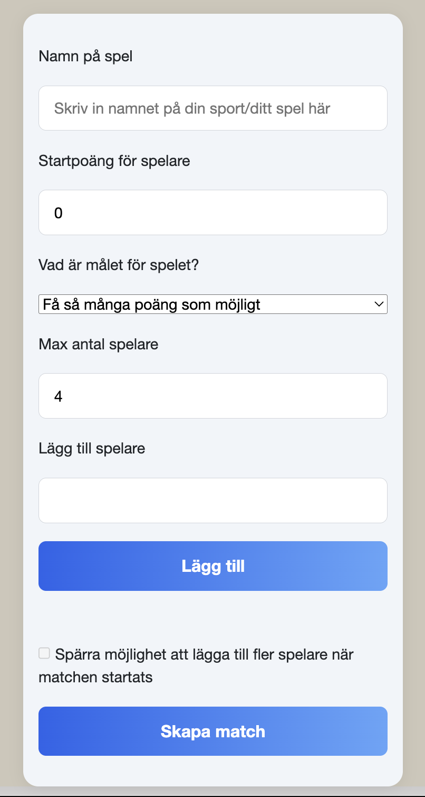
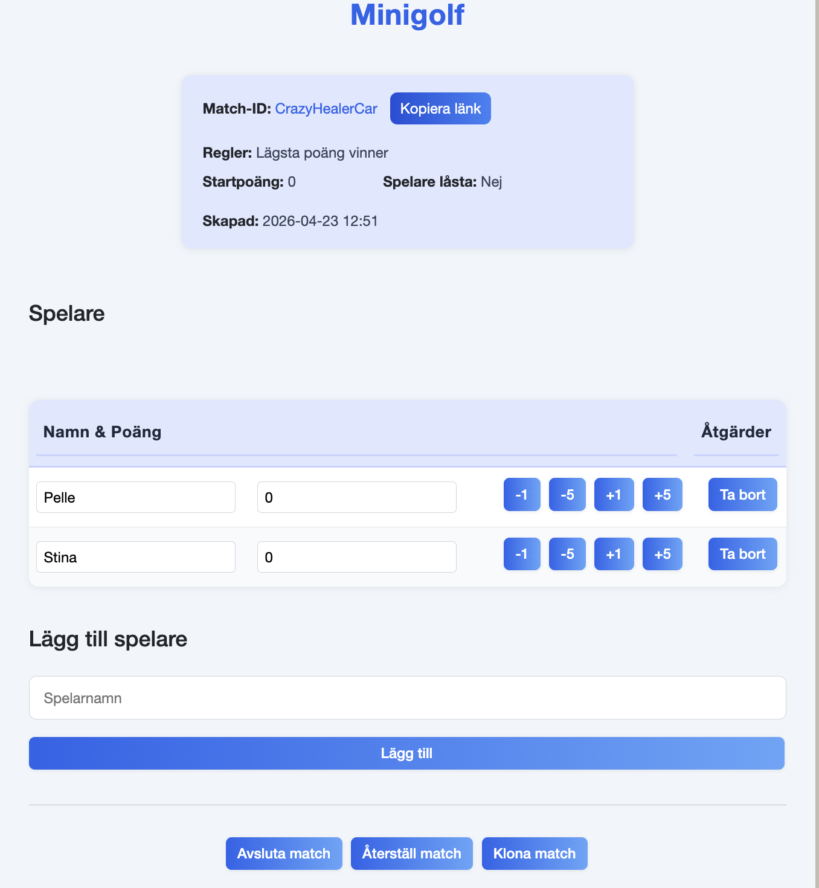

# ScoreCounter (Poängräknaren)


<p align="center">
  
</p>

<p align="center">
  
</p>

## Beskrivning

ScoreCounter är en realtidsapplikation för att skapa och hantera matcher med spelare och poäng.

Systemet låter användare skapa matcher, lägga till spelare och uppdatera poäng i realtid med hjälp av SignalR.

Alla ändringar uppdateras direkt i alla anslutna klienter.

Systemet låter användare:

- Skapa matcher
- Lägga till och ta bort spelare
- Uppdatera poäng i realtid
- Klona eller återställa matcher
- Avsluta matcher
- Följa uppdateringar direkt via SignalR

---

## Funktioner

### Matchhantering

- Skapa match med valfritt spelnamn
- Sätta max antal spelare
- Låsa spelare
- Avsluta match
- Klona match
- Reset match till ursprungsläge

### Spelare

- Lägg till spelare
- Ta bort spelare
- Byt namn
- Kontroll av duplicerade namn
- Poängsystem (öka / minska / sätt direkt)

### Poängsystem

- Öka poäng
- Minska poäng
- Sätt exakt poäng
- Realtidsuppdatering

### Realtid (SignalR)

- PlayerAdded
- PlayerRemoved
- PlayerRenamed
- ScoreChanged
- MatchReset
- MatchFinished

---

## Arkitektur

Projektet är uppdelat i tre huvuddelar:

### Backend

- ASP.NET Core Minimal API
- SignalR Hub
- Entity Framework Core
- MatchStore
- SQLite (development)
- SQL Server (production / Azure)

### Frontend

- Blazor WebAssembly
- Responsiv UI
- Sidebar navigation
- Realtidsuppdatering

### Shared

- Delade modeller (GameMatch, GamePlayer)
- DTOs (Data Transfer Objects)
- Gemensamma regler och kontrakt
- Säkerställer att backend och frontend använder samma datastruktur

---

### API Endpoints

#### Match

- `GET /api/match/{id}` → Hämta match
- `POST /api/match` → Skapa match
- `POST /api/match/{id}/reset` → Reset match
- `POST /api/match/{id}/clone` → Klona match
- `POST /api/match/{id}/finish` → Avsluta match

---

#### Spelare

- `POST /api/match/{id}/player` → Lägg till spelare
- `PUT /api/match/{id}/player/{playerId}/score` → Uppdatera poäng
- `PUT /api/match/{id}/player/{playerId}/name` → Byt namn
- `DELETE /api/match/{id}/player/{playerId}` → Ta bort spelare

---

### SignalR Hub

Endpoint: /matchevents

---

## Flöde i systemet

- Skapa match
- Lägg till spelare
- Anslut klienter via SignalR
- Uppdatera poäng
- Realtidsuppdatering till alla klienter
- Avsluta eller reset match

## Så här kör du programmet

```
cd ScoreCounter
dotnet run
```

## Konfiguration

- Lokal databas
  `Data Source=scorecounter.db`
- Produktion
  - Azure SQL Server
  - Azure Key Vault

## Publicering till Azure Portal

Programmet är förberett för att hostas på Microsoft Azure. Följ dessa steg för att sätta upp allt via Azure Portal:

1. **Skapa en Azure SQL-databas**
   - Gå till Azure Portal och skapa en SQL Database och en SQL Server.
   - Spara anslutningssträngen (Connection String) för databasen.

2. **Skapa en Azure Key Vault**
   - Skapa en Key Vault i samma resource group.
   - Lägg till en hemlighet (Secret) med namnet `SqlScoreCounterConnectionString` och klistra in anslutningssträngen från din SQL-databas.

3. **Skapa en App Service för backend**
   - Skapa en App Service.
   - Publicera backend-projektet till denna App Service (t.ex. via GitHub Actions eller ZIP deploy).

4. **Aktivera Managed Identity för App Service**
   - Gå till App Service > Identity > System assigned > Sätt till "On" och spara.

5. **Ge Key Vault access till App Service**
   - Gå till Key Vault > Access control (IAM) > Lägg till rolltilldelning.
   - Välj rollen "Key Vault Secrets User" och välj din App Service som principal.

---

## Tekniker

- ASP.NET Core
- Blazor WebAssembly
- SignalR
- Entity Framework Core
- SQLite / SQL Server
- Azure

---

## Utvecklare

- Alaa Alsous
- Astrid Skoglund
- Andreas Fransson
- Daniel Viklund
