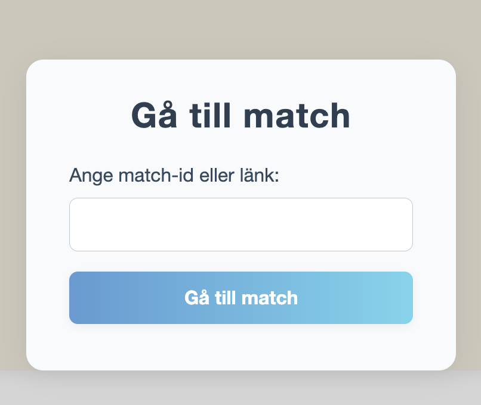

# Poängräknaren

## Om programmet
Poängräknaren är en webbapplikation som tillåter användaren att hålla reda på poäng för en till flera spelare/deltagare i valfri aktivitet. Den kan exempelvis användas för att hålla reda på poäng vid sällskapsspel, idrottsmatcher eller lekar. Användaren kan själv via inställningar skapa en ny match och välja vilka regler som ska gälla: 
- om målet är att få många eller få poäng
- vilka spelare som ska delta
- max antal spelare i matchen

Det går också att låsa inställningar så att det inte går att lägga till fler spelare när matchen skapats.


När en match skapats går det att kopiera länken till matchens id för att skicka till deltagarna. Dessa kan sedan i realtid lägga till/ta bort poäng för spelarna i matchen. Efter att matchen är klar kan den avslutas och resultaten från matchen visas. Det finns även möjlighet att återställa matchen till ursprungsinställningarna som gjordes samt klona matchen om en ny match vill påbörjas.


En deltagare som vill ansluta till eller se resultat av en match kan via Match-knappen i menyn skriva in sitt match-id och se aktuell information.



## Så här startar du programmet
I utvecklarläge kan programmet startas genom att i root directory skriva

```bash
cd Backend
dotnet run
```

Programmet är också förberett för att hostas via Microsoft Azure. För detta krävs att ...